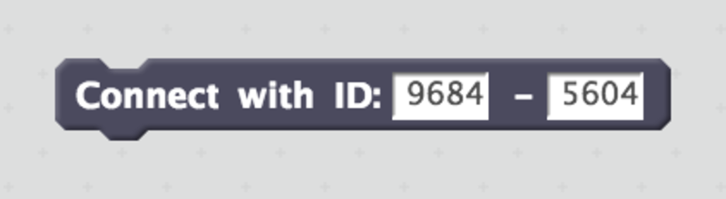
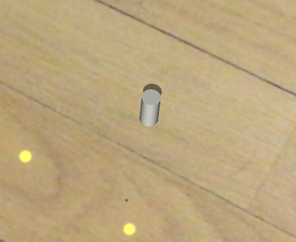
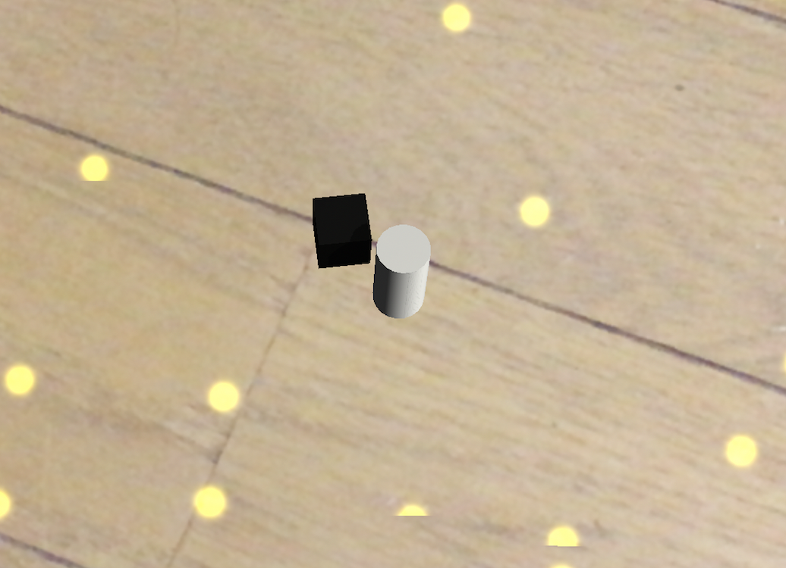
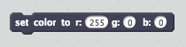

# S2AR(Scratch2ARKit)

S2AR(Scratch2ARKit) connects Scratch* (more specifically ScratchX) and ARKit, then enables anyone to program building blocks in Augmented Reality world.

\* Scratch is developed by the Lifelong Kindergarten Group at the MIT Media Lab. See http://scratch.mit.edu

S2AR is available at [App Store](https://itunes.apple.com/jp/app/s2ar/id1316847947?mt=8).

Demo Movies

- https://www.youtube.com/watch?v=lYuR27QzpL0
- https://www.youtube.com/watch?v=rBz-OfMnzKU
- https://www.youtube.com/watch?v=P9t2iPcgGGw

## How to use

1. On iOS device, start S2AR and you will find ID(connection ID) appeared in the bottom bar.

2. On PC, open a browser then connect to http://scratchx.org/.

  

3. On ScratchX website, click "Open Extension URL", paste "https://champierre.github.io/s2ar/extension/s2ar.js" in URL field and click "Open".

  

4. Click "I understand, continue" button on Warning dialog.

  

5. Special blocks for S2AR are available under "More Blocks" category. Drag "Connect with ID:" block to Scripts Area, and input ID appeared in S2AR app, then click the block.

  

6. Back to S2AR on iOS device, find any surface then tap on it. Coordinate axes should appear there. This will be origin point(x:0, y:0, z:0).

  

7. On ScratchX, drag "set cube at x:1 y: 0 z: 1" block to Scripts Area, then click the block. You will see a gray block is set near to the origin point.

  

  

8. Use "set color to" block to change the block color.

  

9. Use "reset" to delete all blocks.

  

## Sample Scratch Script

