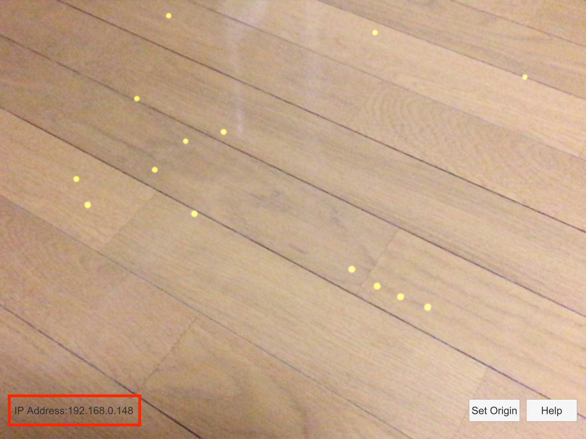
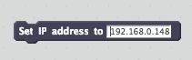

# S2AR(Scratch2ARKit)

S2AR(Scratch2ARKit) connects Scratch* (more specifically ScratchX) and ARKit, then enables anyone to program building blocks in Augmented Reality world.

* Scratch is developed by the Lifelong Kindergarten Group at the MIT Media Lab. See http://scratch.mit.edu

Demo Movie
https://www.youtube.com/watch?v=P9t2iPcgGGw

## How to use

1. Prepare PC and iOS device in the same local network.
2. On iOS device, start S2AR and you will see IP address appeared in the left bottom corner.

  
3. On PC, open a browser then connect to http://scratchx.org/.

  
4. On ScratchX website, click "Open Extension URL", paste "https://champierre.github.io/s2ar/extension/s2ar.js" in URL field and click "Open".

  
5. Click "I understand, continue" button on Warning dialog.

  
6. Special blocks for S2AR are available under "More Blocks" category. Drag "Set IP address to" block to Scripts Area, and input IP address appeared in S2AR app, then click the block.

  
7. Back to S2AR on iOS device, tap "Set origin" in the right bottom corner, find any surface(yellow dots should appear), then tap on it. A small gray pillar should appear. This will be origin point(x:0, y:0, z:0).

  
8. On ScratchX, drag "set cube at x:1 y: 0 z: 1" block to Scripts Area, then click the block. You will see a black block is set near to the origin point.

  

  
9. Use "set color to" block to change the block color.

  
10. Use "reset" to delete all blocks.

  

## Sample Scratch Script

